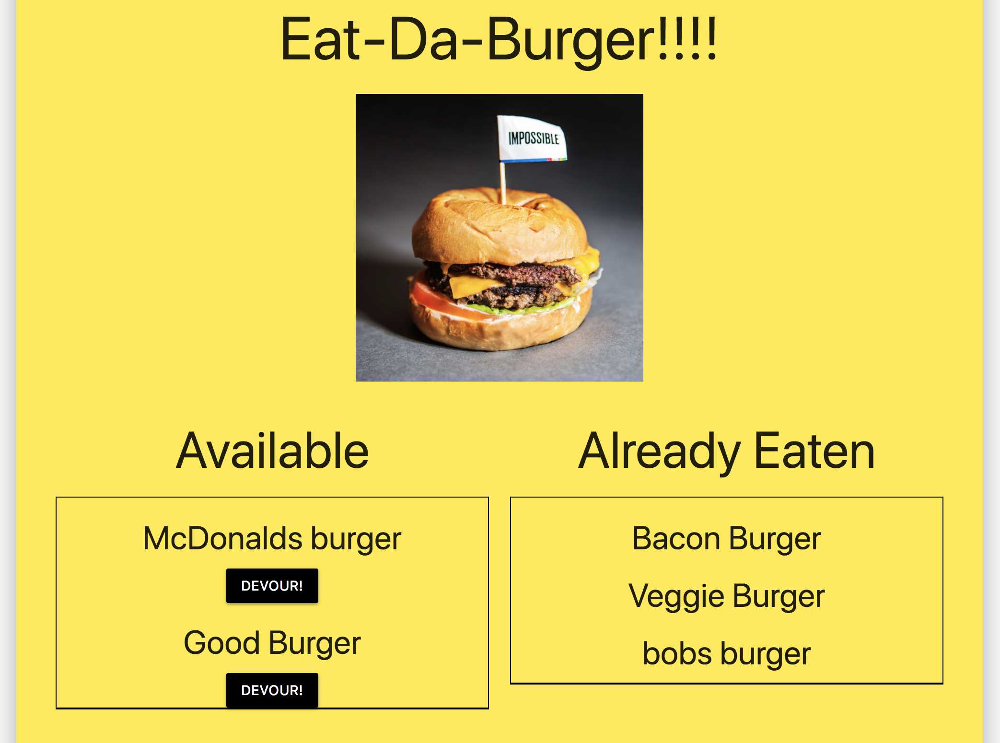

# Eat Da Burger

## What is the App?

Eat-Da-Burger is a basic full-stack webapage that uses express, express-handlebars, MySQL and is deployed via heroku with JawsDB. The app uses a custom ORM rather than sequelize, as an intro exercise to basic routng using MySQL. Checkout the app here! https://pacific-bastion-23235.herokuapp.com/ The basic funsitons of the app are to allow anyone to enter a burger name and add it to a list of burgers that can be eaten with a "Devour it" button associated with each burger. If the button is clicked the burger object is moved to a list of eaten burgers.

## How it Works

The app uses a single MySQL table that adds burgers by name and a boolean value to determine if it has been eaten. SQL commands are handled in a custom ORM.js fial with three basic function for selecting all burgers from the table to be added to the page, inserting a new burger to the database, and updating burgers boolean "eaten" value. 

#### Example SQL code from ORM.js

```
selectAll: function(tableName, cb) {
    connection.query("SELECT * FROM " + tableName + ";", function(err, result) {
      if (err) {
        throw err;
      }
      cb(result);
    });
  }
```

Burgers are loaded onto the page using handlebars to sepereate eaten vs not-eaten burgers into two different tables. Routing is handled with a get, post and put function corresponding to the custom ORM selectAll, insertOne and updateOne calls.

### Purpose

The point of this exercise was to introduce basic routing functionality using a relational database, more projects are listed below the page with all relational databse projects using sequelize in place of custom commands. Check out this and other projects on my Github! https://tmullen1991.github.io/


